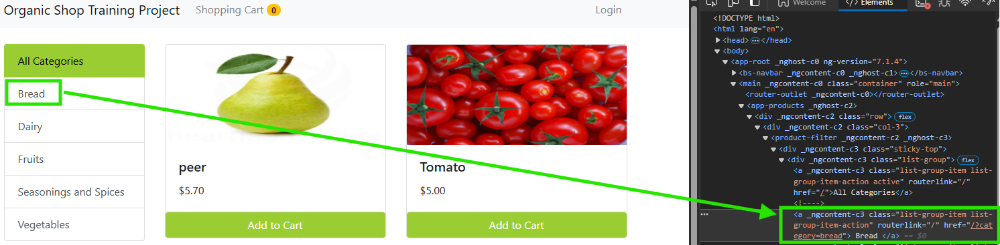
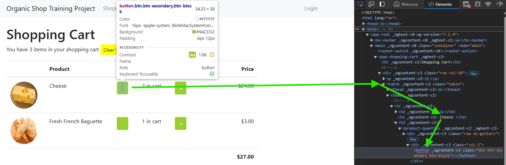

# Notes

## Add introductory docs

1. Create the .gitignore by copying from https://github.com/github/gitignore/blob/main/VisualStudio.gitignore at repo root.
2. Create ./docs/notes.md at repo root to keep notes on what I'm doing.
3. Create README.md explaining the project.

## Add solution and project

Add the solution with 

```pwsh
dotnet new sln --name OrganicShopTrainingProject
```

Add the test project to a new directory ./OrganicShopTrainingProjectPlaywrightTests with 

```pwsh
dotnet new nunit --name OrganicShopTrainingProjectPlaywrightTests --output OrganicShopTrainingProjectPlaywrightTests
```

Add the test project to the solution with 

```pwsh
dotnet sln .\OrganicShopTrainingProject.sln add .\OrganicShopTrainingProjectPlaywrightTests\OrganicShopTrainingProjectPlaywrightTests.csproj
```

Test that the solution builds and tests pass with:

```pwsh
dotnet build
dotnet test
```

## Add Playwright

It's a good idea to follow the [Playwright dotnet docs](https://playwright.dev/dotnet/docs/intro "It's a good idea to read the docs :)")

The latest Playwright for NUNit version available on nuget is [1.46.0](https://www.nuget.org/packages/Microsoft.Playwright.NUnit/1.46.0#supportedframeworks-body-tab (Latest available .NET 8 compatible Playwright.NUnit nuget package from nuget.org))

Install this to the test project with 

```pwsh
dotnet add .\OrganicShopTrainingProjectPlaywrightTests\OrganicShopTrainingProjectPlaywrightTests.csproj package Microsoft.Playwright.nunit --version 1.46.0
```

To actually use Playwright, I need to build the project first so that the powershell script that installs browsers is available.

```pwsh
dotnet build
```

The powershell script is available now. So run it with

```pwsh
pwsh .\OrganicShopTrainingProjectPlaywrightTests\bin\Debug\net8.0\playwright.ps1 install
```

The command has the below installed:

* Chromium 128.0.6613.18 (playwright build v1129) from https://playwright.azureedge.net/builds/chromium/1129/chromium-win64.zip
* Firefox 128.0 (playwright build v1458) from https://playwright.azureedge.net/builds/firefox/1458/firefox-win64.zip
* Webkit 18.0 (playwright build v2051) from https://playwright.azureedge.net/builds/webkit/2051/webkit-win64.zip

Check that the build is still fine with `dotnet test`

## Add Page Objects

The Page Object Model is an [encouraged test practice](https://www.selenium.dev/documentation/test_practices/encouraged/page_object_models/ (Selenium's Java based POM guidance)) on [Selenium.dev](https://www.selenium.dev/). Playwright also has its own [dotnet guidance](https://playwright.dev/dotnet/docs/pom (Playwright's dotnet guidance on implementing page objects for tests)).

Picking the locator is often easy with `AriaRole`. 

### Using `AriaRole`?

Mozilla Developer Network (MDN) explains in https://developer.mozilla.org/en-US/docs/Web/Accessibility/ARIA

> Accessible Rich Internet Applications (ARIA) is a set of roles and attributes that define ways to make web content and web applications (especially those developed with JavaScript) more accessible to people with disabilities.

Enabling accessibility is a good thing. A bad thing is when it's used badly. The same page warns:

> [The first rule of ARIA](https://www.w3.org/TR/using-aria/#rule1) use is "If you can use a native HTML element or attribute with the semantics and behavior you require already built in, instead of re-purposing an element and adding an ARIA role, state or property to make it accessible, then do so."

With this in mind, I use `AriaRole` as much as I can to identify page elements.

### `HomePage`

I wanted `HomePage` to hold the links I needed to click to get to the different categories, providing methods to click them. That's its single responsibility.

I saw it was a link by inspecting the element in the browser:


So I used 

```csharp
BreadLink = Page.GetByRole(AriaRole.Link, new() { Name = "Bread" });
```

### `DairyPage` and `BreadPage`

Within a category of product you get a collection containing many a `product-card`. I wanted to uniquely identify the product I needed in the test so I can click that exact product's "Add to Cart" button and "+" button. The locator logic to identify the card sits there as well as the ability to click on the desired locator.

This resulted in a combination of using selectors

```csharp
CheesePlusButton = Page.Locator("product-card")
            .Filter(new() { HasText = "Cheese" })
            .GetByRole(AriaRole.Button, new() { Name = "+"});
```

There is no AriaRole for "product-card" so I needed to use [`Locator`](https://github.com/microsoft/playwright-dotnet/blob/release-1.46/src/Playwright/Core/Locator.cs) to pass in a string that selects product-card from the DOM. There were many in the Bread category so I [filtered](https://github.com/microsoft/playwright-dotnet/blob/release-1.46/src/Playwright/Core/Locator.cs#191 (This allows you to pass in the optional `LocatorFilterOptions` in `Locator` after you have a collection to match on)) on the one with the text "Cheese". After that, I could use `AriaRole.Button`. 

This is a case where a combination of selector techniques worked. 

### `ShoppingCartPage`

This page's responsibility is to enable picking the right element from the cart to change the quantity of, and to enable checking out.

I explicitly stated in the test that I want less cheese. So I specified I want to remove cheese by passing in "Cheese" inside the test.

```csharp
await ShoppingCartPage.ClickMinusButtonAsync("Cheese");
```

This meant I needed `ShoppingCartPage` to be able to find the product only known when the test was running. Thus I implemented 

```csharp
public async Task ClickMinusButtonAsync(string elementText)
{
    var table = Page.GetByRole(AriaRole.Table);
    var product = table.GetByRole(AriaRole.Row, new () { Name = elementText });
    MinusButton = product.GetByRole(AriaRole.Button, new () { Name = "-" });
    await MinusButton.ClickAsync();
}
```

What this did was find the table, find the right product in the table, and find the "-" for that element.



## `TestBase`

`TestBase` exists as a base for the class for all end-to-end tests. In this case there is just the one but the principle is the same.

The responsibility here is to hide the implementation details from the test class itself, while making available to the test class the objects the test class needs. It is in this spirit that most elements in there are `protected`. The intent is that child classes of `TestBase` are the only ones that can access those `protected` variables and methods.

The tests need a browser tab, so the `OneTimeSetup` creates one. The tests need a way to assert, so this class creates an instance of `PlaywrightTest` to make that available. The tests need to know about the PageObjects so it creates them. The test needs a constant BaseUri so it creates it.

What is also there are the links in the navigation bar. As each page contains the navigation bar, it makes sense that the test base holds the ability to interact with them.

## `EndToEndTests`

This class contains the tests. This led to renaming UnitTest1.cs to EndToEndTests.cs. The tests are designed to be easy to read. This is why `TestBase` exists - to hide implementation detail from the `EndToEndTests`. Now the focus can be specifically on this test case.
